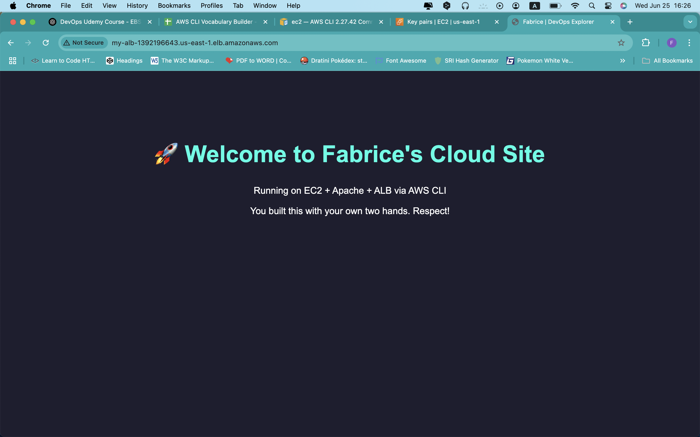

# Fabrice Cloud Site 🚀

This is a static website hosted on **AWS EC2**, served through **Apache**, and load-balanced with an **Application Load Balancer (ALB)** — all deployed using the **AWS CLI**.

## 💡 What I learned
- AWS CLI resource provisioning
- EC2 & EBS setup
- Load Balancer + target group config
- Apache server setup
- Hosting & debugging real web traffic
- Pushing to GitHub like a DevOps pro

## 🛠 Tech Stack
- Amazon EC2
- Amazon EBS
- Apache HTTPD
- ALB (Application Load Balancer)
- AWS CLI
- Git & GitHub

## 📸 Screenshot

## ⚙️ Author
**Fabrice Mansoni Mabela**  
LinkedIn / GitHub / DevOps Explorer 🧑‍🚀
